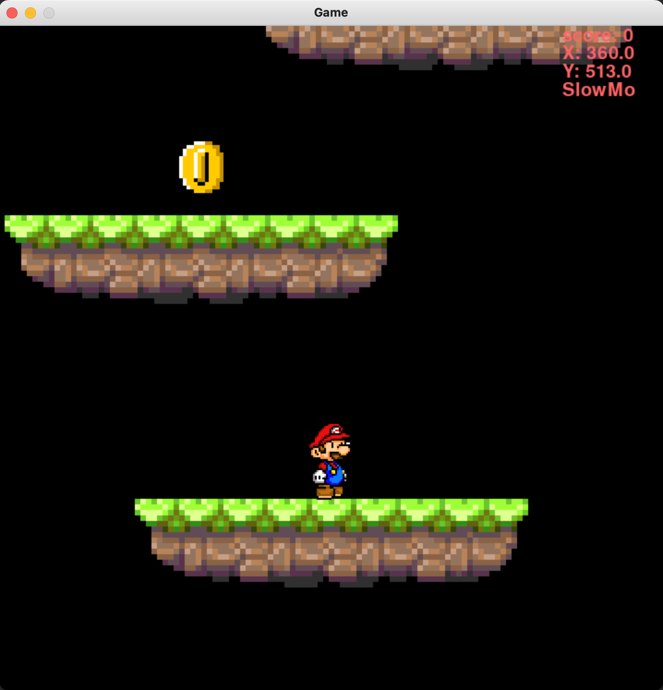

PlatformerPython:
--------------------------
This is a janky platformer game that I built in Python on July 7th 2022

The Controls:
--------------------------
A or Left Arrow | Left
D or Right Arrow | Right 
Space | Jump 
E | SlowMo 
Q | Coords

The Assets:
--------------------------
If it wasn't clear already I did not make these assets, I just found them on the internet for this game

Github Repo:
--------------------------
https://github.com/ExplodingCB/PlatformerPython

Download Me!:
--------------------------
https://github.com/ExplodingCB/PlatformerPython/archive/refs/heads/main.zip

